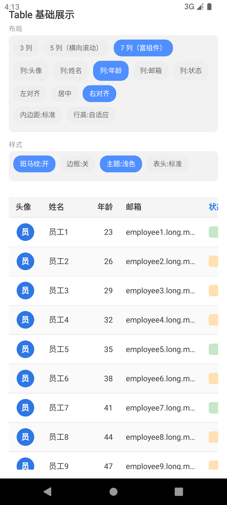
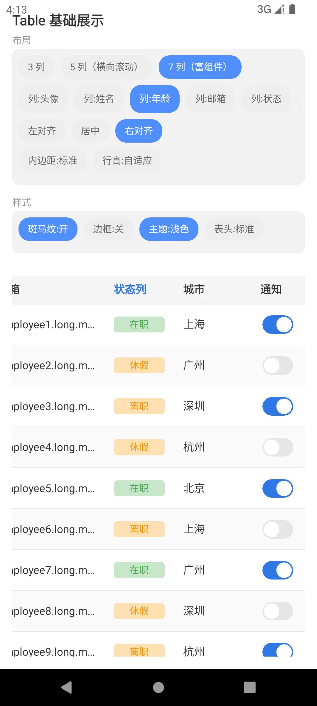

# KuiklyTable

基于 [KuiklyUI](https://github.com/Tencent-TDS/KuiklyUI) 跨端框架构建的声明式表格组件，使用 ComposeView 路线在 `commonMain` 内用基础组件组合实现，支持 Android、iOS、鸿蒙多端运行。

当前已支持基础展示与移动端适配能力（列定义、双向滚动、主题、自定义渲染、状态层、富组件列），交互能力（排序、筛选、分页）开发中，详见 [Roadmap](#roadmap)。

## 效果预览

### 基础展示

列定义、行列渲染、斑马纹、列对齐、文字截断。五列模式支持横向滚动，表体纵向滚动时表头保持固定。

<div align="center">
  
  
</div>

### 主题与自定义渲染

内置浅色 / 深色 / 蓝色三套主题预设，支持通过 `TableThemeColors` 覆盖任意语义色。状态列使用自定义 cellRenderer 渲染彩色标签：

| 浅色主题 | 深色主题 | 蓝色主题 |
| --- | --- | --- |
|  |  |  |

<div align="center">
  
</div>

### 富组件列

7 列模式下表格支持圆形头像（Avatar）、语义状态标签（绿=在职 / 橙=休假、离职）、Switch 开关等复合组件：

| 左侧：头像 + 姓名 + 年龄 + 邮箱 + 状态 | 横滑右侧：状态 + 城市 + 通知 Switch |
| --- | --- |
|  |  |

### 移动端适配

可显式切换为横向 Table 或 Mobile List 卡片模式；支持空 / 加载 / 错误状态层，错误态提供重试入口：

| Mobile List 卡片 | Empty 状态 |
| --- | --- |
|  |  |

| Loading 状态 | Error 状态（重试入口） |
| --- | --- |
|  |  |

<div align="center">
  
</div>

### 溢出提示

被截断的文本单元格支持点击触发溢出事件，Demo 使用该事件展示 title-like 全文提示：

<div align="center">
  
</div>

## 接入指南

> 组件处于活跃开发中，**尚未发布到 Maven 仓库**。当前为源码级接入。

### 方式一：运行内置 Demo（推荐先体验）

克隆本仓库，运行 `androidApp` 宿主，在路由页输入 `table_basic` 进入演示页。

### 方式二：集成到你的项目（源码级）

1. 将 `KuiklyTable` 模块拷贝到你的工程，并在 `settings.gradle.kts` 中 include：

```kotlin
include(":KuiklyTable")
```

2. 在业务模块的 `build.gradle.kts` 中添加依赖：

```kotlin
kotlin {
    sourceSets {
        val commonMain by getting {
            dependencies {
                implementation(project(":KuiklyTable"))
            }
        }
    }
}
```

> 后续计划发布到 Maven，届时可直接 `implementation("com.arialentropy.kuiklytable:KuiklyTable:<version>")` 接入。

## 快速使用

```kotlin
TableView<User> {
    attr {
        columns.addAll(
            listOf(
                ColumnModel(key = "name", title = "姓名", accessor = { it.name }, width = 80f),
                ColumnModel(
                    key = "age", title = "年龄",
                    accessor = { it.age.toString() },
                    width = 60f,
                    alignment = ColumnAlignment.End,   // 数字列右对齐
                ),
                ColumnModel(key = "email", title = "邮箱", accessor = { it.email }),
            )
        )
        data = users
        zebraStripe = true
        bordered = false
        mobileMode = TableMobileMode.Table
        mobilePrimaryColumnKey = "name"
        mobileStatusColumnKey = "status"
    }
    event {
        rowClick = { user -> /* 行点击 */ }
        retry = { /* 重新加载 */ }
    }
}
```

## 核心 API

### TableView（入口）

表格的顶层入口，是 `ViewContainer` 的扩展函数：

```kotlin
fun <T> ViewContainer<*, *>.TableView(init: TableView<T>.() -> Unit)
```

### TableAttr（配置）

| 属性 | 类型 | 默认值 | 说明 |
|------|------|--------|------|
| `columns` | `ObservableList<ColumnModel<T>>` | 空列表 | 列定义列表；通过列表 mutation 支持动态增删列 |
| `data` | `List<T>` | `emptyList()` | 数据源 |
| `zebraStripe` | `Boolean` | `true` | 是否启用斑马纹 |
| `bordered` | `Boolean` | `false` | 是否显示列分隔线；水平分隔线始终显示 |
| `cellPaddingH` | `Float` | `12f` | 单元格水平内边距（dp） |
| `cellPaddingV` | `Float` | `10f` | 单元格垂直内边距（dp） |
| `rowHeight` | `Float` | `0f` | 固定行高（dp）；`0f` 表示由内容与内边距自适应 |
| `themeColors` | `TableThemeColors` | `TableThemeColors()` | 主题色（表头/文字/分隔线/行背景/状态层/卡片） |
| `mobileMode` | `TableMobileMode` | `TableMobileMode.Table` | 移动端展示模式；显式选择横向 Table 或 Mobile List |
| `mobilePrimaryColumnKey` | `String?` | `null` | Mobile List 主字段列；未配置时使用第一列 |
| `mobileStatusColumnKey` | `String?` | `null` | Mobile List 状态标签列；未配置时不显示状态标签 |
| `mobileStatusTagPresetByText` | `Map<String, TableStatusTagPreset>` | `emptyMap()` | Mobile List 状态文本到语义预设的业务映射 |
| `mobileStatusTagStyleByText` | `Map<String, TableStatusTagStyle>` | `emptyMap()` | Mobile List 状态文本到具体标签色的业务映射，优先级高于语义预设 |
| `mobileStatusTagStyleResolver` | `((T, String, TableThemeColors) -> TableStatusTagStyle)?` | `null` | Mobile List 状态标签样式解析器；未配置时使用 success / warning / danger / neutral / info 预设 |
| `loading` | `Boolean` | `false` | Loading 状态；保留旧内容并降低透明度 |
| `errorText` | `String?` | `null` | Error 状态文案；非 null 时显示错误层 |
| `emptyText` | `String` | `"暂无数据"` | Empty 状态文案 |
| `loadingText` | `String` | `"加载中…"` | Loading 状态文案 |
| `retryText` | `String` | `"重试"` | Error 状态重试按钮文案 |
| `enableOverflowCellClick` | `Boolean` | `true` | 是否为截断的默认文本单元格启用溢出点击事件 |

`TableThemeColors.Light` 和 `TableThemeColors.Dark` 提供浅色/深色预设，使用方也可以直接构造 `TableThemeColors` 覆盖任意语义角色。

### ColumnModel（列模型）

| 字段 | 类型 | 默认值 | 说明 |
|------|------|--------|------|
| `key` | `String` | — | 列唯一标识 |
| `title` | `String` | — | 表头文字 |
| `accessor` | `(T) -> String` | — | 从数据行提取该列显示值 |
| `width` | `Float?` | `null` | 固定列宽（dp）；`null` 表示弹性宽度 |
| `flex` | `Float` | `1f` | 弹性权重（`width` 为 `null` 时生效） |
| `alignment` | `ColumnAlignment` | `Start` | 对齐方式（响应式，运行时修改即重渲染） |
| `cellRenderer` | `((ViewContainer, T, ColumnModel<T>) -> Unit)?` | `null` | 自定义单元格内容；未配置时使用默认 Text |
| `headerRenderer` | `((ViewContainer, ColumnModel<T>) -> Unit)?` | `null` | 自定义表头内容；未配置时使用默认 Text |

### ColumnAlignment（对齐方式）

| 值 | 说明 |
|----|------|
| `Start` | 左对齐（默认，适合文本） |
| `Center` | 居中 |
| `End` | 右对齐（适合数字列） |

### TableMobileMode（移动端模式）

| 值 | 说明 |
|----|------|
| `Table` | 强制使用横向表格 |
| `List` | 强制使用 Mobile List 卡片模式 |

### TableEvent（事件）

| 回调 | 类型 | 说明 |
|------|------|------|
| `rowClick` | `((T) -> Unit)?` | 行点击，回调该行数据 |
| `retry` | `(() -> Unit)?` | 错误状态重试点击回调 |
| `overflowCellClick` | `((TableOverflowCellInfo<T>) -> Unit)?` | 截断单元格点击，回调溢出文本与位置信息 |

## Demo 配置面板

`shared` 模块内置演示页 `table_basic`，在 Android 宿主中运行后通过路由页输入 `table_basic` 进入。配置面板分为四组：

- **布局**：3 列 / 5 列（横向滚动）/ 7 列（富组件）切换，任意列对齐方式，内边距与行高
- **样式**：斑马纹、边框、主题（浅色/深色/蓝色）、表头紧凑模式
- **渲染**：状态列自定义 renderer 开关、溢出提示开关
- **模式与状态**：MobileMode（Table/List）、状态层（正常/空/加载/错误）

## Roadmap

- [x] 列定义、行列渲染、列对齐、斑马纹、文字截断
- [x] 横向滚动 + 纵向滚动 + 固定表头
- [x] 边框、内边距、行高配置
- [x] 主题预设（浅色/深色/蓝色）与自定义单元格 renderer
- [x] 富组件列（Avatar、状态标签、Switch）
- [x] 空 / 加载 / 错误状态层
- [x] Mobile List 卡片模式
- [x] 截断单元格溢出提示事件
- [ ] 行选择（Checkbox / 单选）
- [ ] 列排序
- [ ] 筛选
- [ ] 分页
- [ ] 固定列（首列/尾列锁定）
- [ ] 虚拟滚动（大数据量优化）

## 项目结构

| 模块 | 说明 |
| --- | --- |
| `KuiklyTable` | 表格组件本体（ComposeView 实现） |
| `shared` | 演示 Demo 页面 |
| `androidApp` / `iosApp` / `ohosApp` | 各平台宿主工程 |

## License

[MIT](LICENSE)
