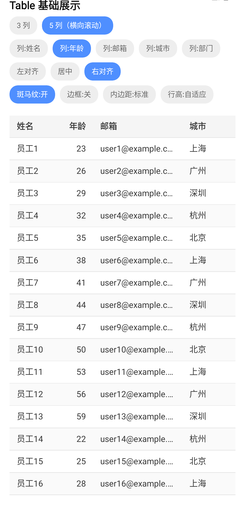
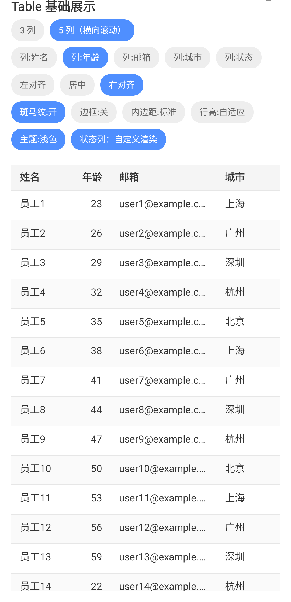
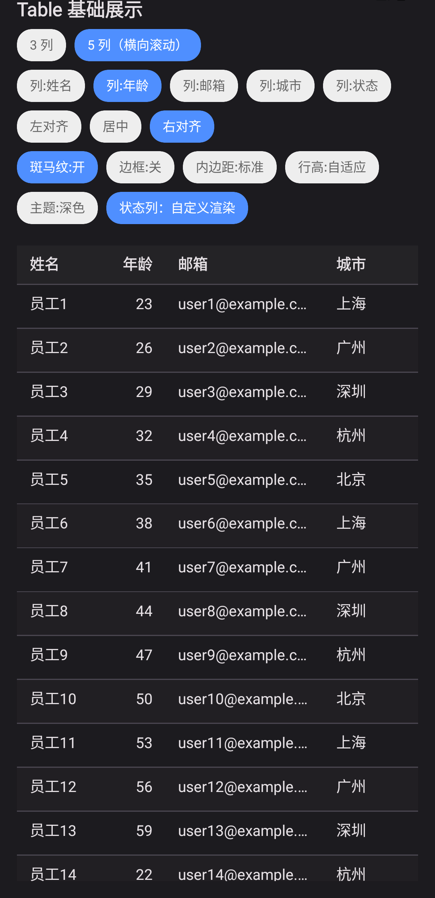
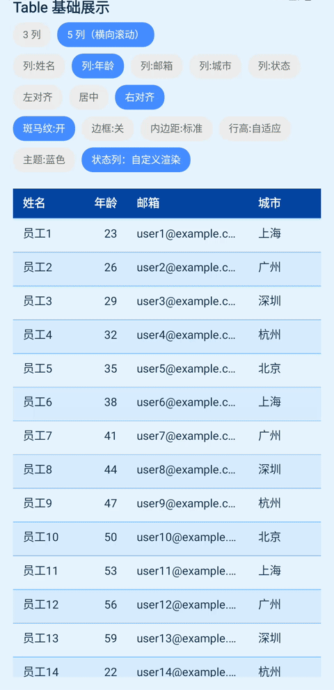
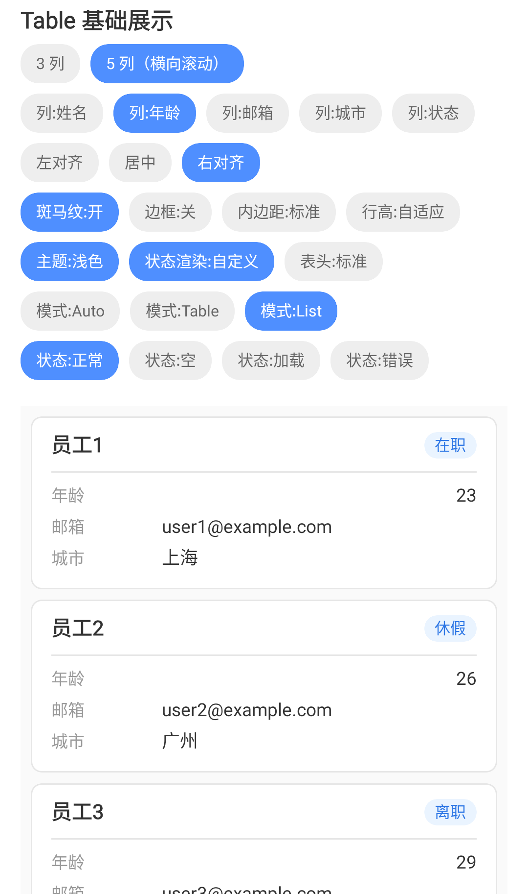
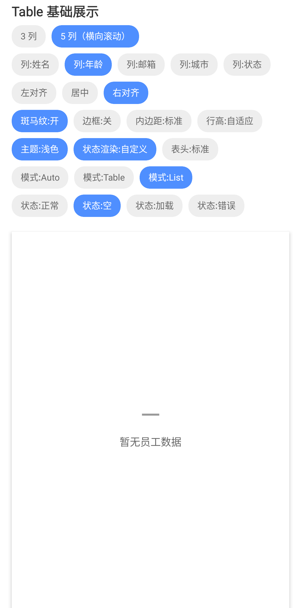
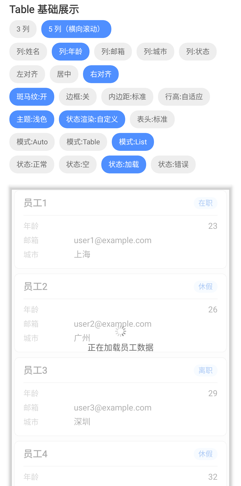
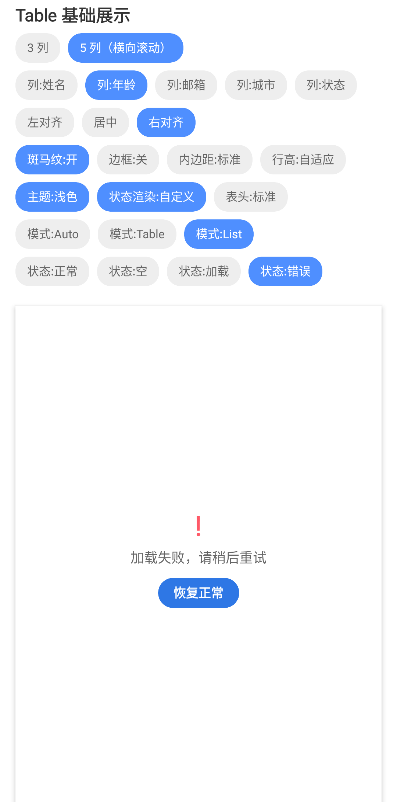
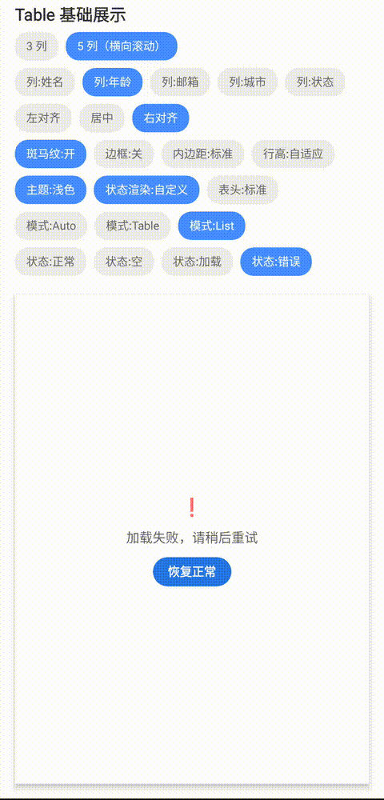
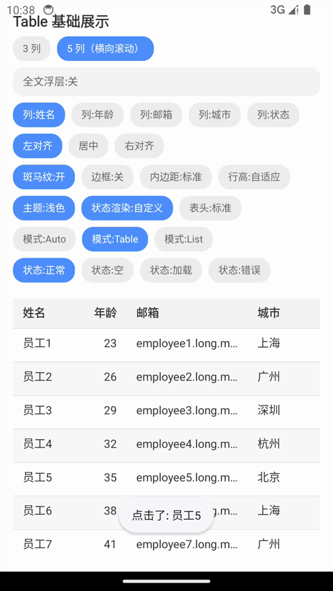

# KuiklyTable

基于 [KuiklyUI](https://github.com/Tencent-TDS/KuiklyUI) 跨端框架构建的声明式表格组件，使用 ComposeView 路线在 `commonMain` 内用基础组件组合实现，支持 Android、iOS、鸿蒙多端运行。

> 当前处于早期开发阶段（Simple Table），能力边界见下方 Roadmap。

## 效果预览

<div align="center">
  
</div>

上图为内置 Demo（`table_basic`），顶部配置面板可实时切换列数、任意列的对齐方式、斑马纹、边框、内边距与行高。五列模式支持横向滚动，表体纵向滚动时表头保持固定。

ST-3 还提供浅色、深色和蓝色主题，以及状态列的自定义 renderer：

| 浅色主题 | 深色主题 | 蓝色主题 |
| --- | --- | --- |
|  |  |  |

<div align="center">
  
</div>

<div align="center">
  
</div>

ST-4 新增状态层与 Mobile List 默认卡片转译：

| Mobile List 默认卡片 | Empty 状态层 |
| --- | --- |
|  |  |

| Loading 状态层 | 组件 Error 状态（重试入口） |
| --- | --- |
|  |  |

| Retry 恢复 |
| --- |
|  |

ST-5 新增截断单元格全文浮层，支持点击被省略的默认文本查看完整内容，并可点击外部关闭：

| 截断文本全文浮层 |
| --- |
|  |

## 接入指南

> ⚠️ 组件处于活跃开发中，**尚未发布到 Maven 仓库**。当前为源码级接入。

### 方式一：运行内置 Demo（推荐先体验）

克隆本仓库，运行 `androidApp` 宿主，在路由页输入 `table_basic` 进入演示页。

### 方式二：集成到你的项目（源码级）

1. 将 `KuiklyTable` 模块拷贝到你的工程，并在 `settings.gradle.kts` 中 include：

```kotlin
include(":KuiklyTable")
```

2. 在业务模块的 `build.gradle.kts` 中添加依赖：

```kotlin
kotlin {
    sourceSets {
        val commonMain by getting {
            dependencies {
                implementation(project(":KuiklyTable"))
            }
        }
    }
}
```

> 后续计划发布到 Maven，届时可直接 `implementation("com.arialentropy.kuiklytable:KuiklyTable:<version>")` 接入。

## 核心 API

### TableView（入口）

表格的顶层入口，是 `ViewContainer` 的扩展函数：

```kotlin
fun <T> ViewContainer<*, *>.TableView(init: TableView<T>.() -> Unit)
```

### TableAttr（配置）

| 属性 | 类型 | 默认值 | 说明 |
|------|------|--------|------|
| `columns` | `ObservableList<ColumnModel<T>>` | 空列表 | 列定义列表；通过列表 mutation 支持动态增删列 |
| `data` | `List<T>` | `emptyList()` | 数据源 |
| `zebraStripe` | `Boolean` | `true` | 是否启用斑马纹 |
| `bordered` | `Boolean` | `false` | 是否显示列分隔线；水平分隔线始终显示 |
| `cellPaddingH` | `Float` | `12f` | 单元格水平内边距（dp） |
| `cellPaddingV` | `Float` | `10f` | 单元格垂直内边距（dp） |
| `rowHeight` | `Float` | `0f` | 固定行高（dp）；`0f` 表示由内容与内边距自适应 |
| `themeColors` | `TableThemeColors` | `TableThemeColors()` | 主题色（表头/文字/分隔线/行背景/状态层/Mobile List 默认卡片） |
| `mobileMode` | `TableMobileMode` | `TableMobileMode.Auto` | 移动端展示模式；Auto 下列数 ≤ 3 转为 Mobile List |
| `mobilePrimaryColumnKey` | `String?` | `null` | Mobile List 主字段列；未配置时使用第一列 |
| `mobileStatusColumnKey` | `String?` | `null` | Mobile List 状态标签列；未配置时不显示状态标签 |
| `loading` | `Boolean` | `false` | Loading 状态；保留旧内容并降低透明度 |
| `errorText` | `String?` | `null` | Error 状态文案；非 null 时显示错误层 |
| `emptyText` | `String` | `"暂无数据"` | Empty 状态文案 |
| `loadingText` | `String` | `"加载中…"` | Loading 状态文案 |
| `retryText` | `String` | `"重试"` | Error 状态重试按钮文案 |
| `enableOverflowPopup` | `Boolean` | `true` | 是否为实际截断的默认文本单元格启用点击全文浮层；自定义 renderer 不自动接管 |

`TableThemeColors.Light` 和 `TableThemeColors.Dark` 提供浅色/深色预设，使用方也可以直接构造 `TableThemeColors` 覆盖语义角色。

### ColumnModel（列模型）

| 字段 | 类型 | 默认值 | 说明 |
|------|------|--------|------|
| `key` | `String` | — | 列唯一标识 |
| `title` | `String` | — | 表头文字 |
| `accessor` | `(T) -> String` | — | 从数据行提取该列显示值 |
| `width` | `Float?` | `null` | 固定列宽（dp）；`null` 表示弹性宽度 |
| `flex` | `Float` | `1f` | 弹性权重（`width` 为 `null` 时生效） |
| `alignment` | `ColumnAlignment` | `Start` | 对齐方式（响应式，运行时修改即重渲染） |
| `cellRenderer` | `((ViewContainer, T, ColumnModel<T>) -> Unit)?` | `null` | 可选自定义单元格内容；未配置时使用默认 Text |

### ColumnAlignment（对齐方式）

| 值 | 说明 |
|----|------|
| `Start` | 左对齐（默认，适合文本） |
| `Center` | 居中 |
| `End` | 右对齐（适合数字列） |

### TableMobileMode（移动端模式）

| 值 | 说明 |
|----|------|
| `Auto` | 列数 ≤ 3 时自动转为 Mobile List，否则保留横向表格 |
| `Table` | 强制使用横向表格 |
| `List` | 强制使用 Mobile List；当前默认渲染为卡片 |

### TableEvent（事件）

| 回调 | 类型 | 说明 |
|------|------|------|
| `rowClick` | `((T) -> Unit)?` | 行点击，回调该行数据 |
| `retry` | `(() -> Unit)?` | 错误状态重试点击回调 |

## 快速使用

```kotlin
TableView<User> {
    attr {
        columns.addAll(
            listOf(
                ColumnModel(key = "name", title = "姓名", accessor = { it.name }, width = 80f),
                ColumnModel(
                    key = "age", title = "年龄",
                    accessor = { it.age.toString() },
                    width = 60f,
                    alignment = ColumnAlignment.End,   // 数字列右对齐
                ),
                ColumnModel(key = "email", title = "邮箱", accessor = { it.email }),
            )
        )
        data = users
        zebraStripe = true
        bordered = false
        mobileMode = TableMobileMode.Auto
        mobilePrimaryColumnKey = "name"
        mobileStatusColumnKey = "status"
        loading = false
        errorText = null
        enableOverflowPopup = true
    }
    event {
        rowClick = { user -> /* 行点击 */ }
        retry = { /* 重新加载 */ }
    }
}
```

## Demo

`shared` 模块内置演示页 `table_basic`，在 Android 宿主中运行后通过路由页输入 `table_basic` 进入，支持交互式切换 3/5 列、任意列对齐方式、斑马纹、边框、内边距与行高。

ST-4 Demo 在同一页面新增：

- MobileMode：Auto / Table / List，Auto 可配合 3/5 列切换验证默认转译规则。
- 状态层：正常 / 空 / 加载 / 错误；错误态的“恢复正常”按钮会真实恢复数据并触发 toast。

ST-5 Demo 在同一页面新增：

- 全文浮层：开 / 关；开启时点击被省略的默认文本单元格显示完整内容，关闭后保留 ellipsis 并回到普通行点击。

## Roadmap

- [x] Simple Table：列定义、行列渲染、列对齐、斑马纹、文字截断
- [x] 横向滚动 + 纵向滚动 + 固定表头
- [x] 边框、内边距、行高配置
- [x] ST-3：主题预设与自定义单元格 renderer
- [x] 空 / 加载 / 错误状态层
- [x] Mobile List 模式（当前默认卡片转译）
- [x] 截断单元格全文浮层
- [ ] Data Table Basic：行选择、排序、筛选、分页
- [ ] Data Table Enhanced / Advanced：固定列、自定义单元格、虚拟滚动等

## 项目结构

| 模块 | 说明 |
| --- | --- |
| `KuiklyTable` | 表格组件本体 |
| `shared` | 演示 Demo 页面 |
| `androidApp` / `iosApp` / `ohosApp` | 各平台宿主工程 |

## License

[MIT](LICENSE)
