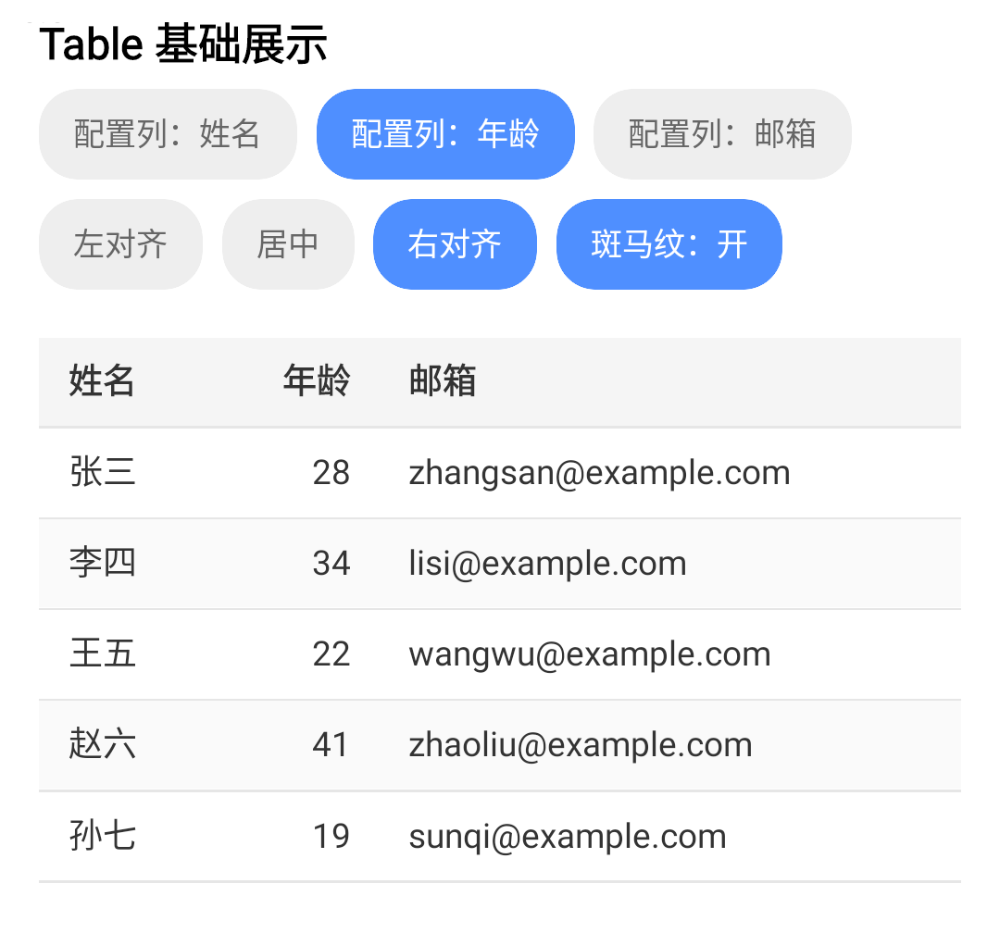

# KuiklyTable

基于 [KuiklyUI](https://github.com/Tencent-TDS/KuiklyUI) 跨端框架构建的声明式表格组件，使用 ComposeView 路线在 `commonMain` 内用基础组件组合实现，支持 Android、iOS、鸿蒙多端运行。

> 当前处于早期开发阶段（Simple Table），能力边界见下方 Roadmap。

## 效果预览

<div align="center">
  
</div>

上图为内置 Demo（`table_basic`），顶部为可交互配置面板，可实时切换任意列的对齐方式与斑马纹。

## 接入指南

> ⚠️ 组件处于活跃开发中，**尚未发布到 Maven 仓库**。当前为源码级接入。

### 方式一：运行内置 Demo（推荐先体验）

克隆本仓库，运行 `androidApp` 宿主，在路由页输入 `table_basic` 进入演示页。

### 方式二：集成到你的项目（源码级）

1. 将 `KuiklyTable` 模块拷贝到你的工程，并在 `settings.gradle.kts` 中 include：

```kotlin
include(":KuiklyTable")
```

2. 在业务模块的 `build.gradle.kts` 中添加依赖：

```kotlin
kotlin {
    sourceSets {
        val commonMain by getting {
            dependencies {
                implementation(project(":KuiklyTable"))
            }
        }
    }
}
```

> 后续计划发布到 Maven，届时可直接 `implementation("com.arialentropy.kuiklytable:KuiklyTable:<version>")` 接入。

## 核心 API

### TableView（入口）

表格的顶层入口，是 `ViewContainer` 的扩展函数：

```kotlin
fun <T> ViewContainer<*, *>.TableView(init: TableView<T>.() -> Unit)
```

### TableAttr（配置）

| 属性 | 类型 | 默认值 | 说明 |
|------|------|--------|------|
| `columns` | `List<ColumnModel<T>>` | `emptyList()` | 列定义列表 |
| `data` | `List<T>` | `emptyList()` | 数据源 |
| `zebraStripe` | `Boolean` | `true` | 是否启用斑马纹 |
| `themeColors` | `TableThemeColors` | `TableThemeColors()` | 主题色（表头/文字/分隔线/行背景） |

### ColumnModel（列模型）

| 字段 | 类型 | 默认值 | 说明 |
|------|------|--------|------|
| `key` | `String` | — | 列唯一标识 |
| `title` | `String` | — | 表头文字 |
| `accessor` | `(T) -> String` | — | 从数据行提取该列显示值 |
| `width` | `Float?` | `null` | 固定列宽（dp）；`null` 表示弹性宽度 |
| `flex` | `Float` | `1f` | 弹性权重（`width` 为 `null` 时生效） |
| `alignment` | `ColumnAlignment` | `Start` | 对齐方式（响应式，运行时修改即重渲染） |

### ColumnAlignment（对齐方式）

| 值 | 说明 |
|----|------|
| `Start` | 左对齐（默认，适合文本） |
| `Center` | 居中 |
| `End` | 右对齐（适合数字列） |

### TableEvent（事件）

| 回调 | 类型 | 说明 |
|------|------|------|
| `rowClick` | `((T) -> Unit)?` | 行点击，回调该行数据 |

## 快速使用

```kotlin
TableView<User> {
    attr {
        columns = listOf(
            ColumnModel(key = "name", title = "姓名", accessor = { it.name }, width = 80f),
            ColumnModel(
                key = "age", title = "年龄",
                accessor = { it.age.toString() },
                width = 60f,
                alignment = ColumnAlignment.End,   // 数字列右对齐
            ),
            ColumnModel(key = "email", title = "邮箱", accessor = { it.email }),
        )
        data = users
        zebraStripe = true
    }
    event {
        rowClick = { user -> /* 行点击 */ }
    }
}
```

## Demo

`shared` 模块内置演示页 `table_basic`，在 Android 宿主中运行后通过路由页输入 `table_basic` 进入，支持交互式切换任意列的对齐方式与斑马纹开关。

## Roadmap

- [x] Simple Table：列定义、行列渲染、列对齐、斑马纹、文字截断
- [ ] 横向滚动 + 固定表头
- [ ] 空 / 加载 / 错误状态层
- [ ] Mobile List 模式（移动端卡片转译）
- [ ] Data Table Basic：行选择、排序、筛选、分页
- [ ] Data Table Enhanced / Advanced：固定列、自定义单元格、虚拟滚动等

## 项目结构

| 模块 | 说明 |
| --- | --- |
| `KuiklyTable` | 表格组件本体 |
| `shared` | 演示 Demo 页面 |
| `androidApp` / `iosApp` / `ohosApp` | 各平台宿主工程 |

## License

[MIT](LICENSE)
