# KuiklyTable

本仓库是 KuiklyUI 表格组件活动的独立仓库作答。仓库本身就是交付物，包含表格组件实现、showcase 验证页面、跨端宿主工程和截图/GIF 验收材料。

KuiklyTable 基于 KuiklyUI ComposeView 路线实现，在 `commonMain` 内使用 `View`、`Text`、`Scroller`、`List` 等基础组件组合渲染，不依赖平台原生 Table 控件。当前重点是 Simple Table 展示能力和 Data Table Basic 交互能力的逐步验证。

## 快速运行

1. 使用 Android Studio 打开本仓库。
2. 运行 `androidApp`。
3. App 默认进入 `table_basic` Table showcase 页面。
4. 通过顶部配置面板切换布局、样式、渲染、移动端模式和状态层。

如需调试其他 Kuikly 页面，可通过 `KuiklyRenderActivity.start(context, pageName, pageData)` 显式传入目标页面名。

也可以在命令行验证编译：

```bash
./gradlew :KuiklyTable:compileDebugKotlinAndroid
./gradlew :shared:compileDebugKotlinAndroid
./gradlew :androidApp:compileDebugKotlin
```

## 项目结构

| 模块 | 说明 |
| --- | --- |
| `KuiklyTable` | 表格组件本体，包含列模型、主题、TableView 渲染和事件 API |
| `shared` | showcase / Demo 模块，提供 `table_basic` 验收页面 |
| `androidApp` | Android 宿主，用于运行、截图和 GIF 录制 |
| `iosApp` / `ohosApp` | iOS / 鸿蒙宿主工程 |
| `assets` | README 展示截图和 GIF 验收材料 |

## 当前能力

- 列定义：`ColumnModel` 支持 key、title、accessor、固定宽度、flex 宽度和列对齐。
- 基础展示：表头、数据行、斑马纹、水平分隔线、可选列边框、行高和内边距配置。
- 滚动：单个横向 `Scroller` 包裹表头和纵向 `List`，保证横向滚动时表头和内容同步；纵向滚动时表头固定。
- 主题：内置 Light / Dark 预设，并支持通过 `TableThemeColors` 覆盖语义色。
- 自定义渲染：支持数据单元格 `cellRenderer` 和表头 `headerRenderer`；Table 只提供渲染插槽，头像、状态标签和 Switch 均为 Demo 使用方示例。
- 状态层：支持 Empty / Loading / Error，错误态可触发 retry 回调。
- 移动端模式：由使用方显式选择 `TableMobileMode.Table` 或 `TableMobileMode.List`；不按列数自动切换。
- 溢出提示：默认文本单元格被截断时可触发 `overflowCellClick`，由使用方决定展示 tooltip / popover / sheet。

## 效果预览

### 基础展示

列定义、行列渲染、斑马纹、列对齐、文字截断。五列模式支持横向滚动，表体纵向滚动时表头保持固定。

<div align="center">
  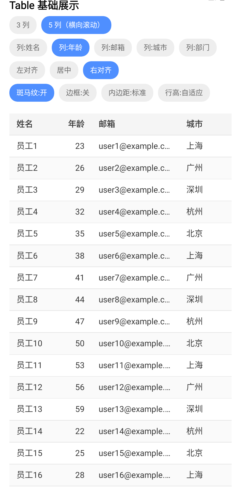
  
</div>

### 主题与自定义渲染

内置浅色 / 深色 / 蓝色三套主题预设，支持通过 `TableThemeColors` 覆盖任意语义色。状态列使用自定义 `cellRenderer` 渲染彩色标签。

| 浅色主题 | 深色主题 | 蓝色主题 |
| --- | --- | --- |
| 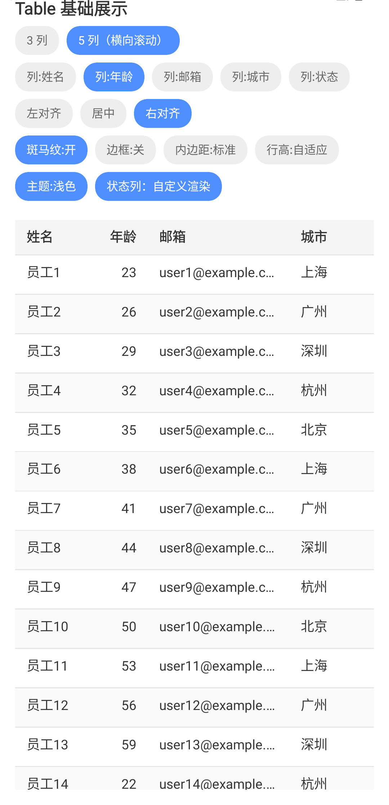 | 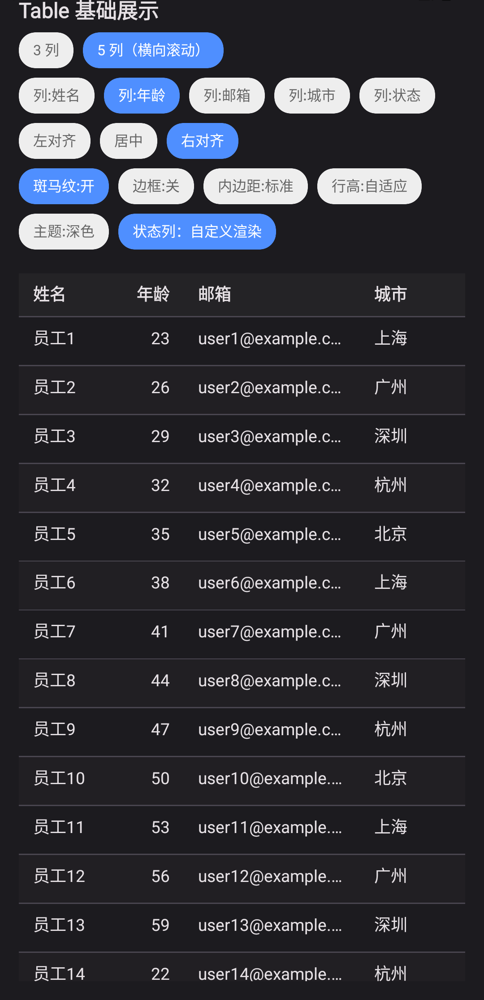 |  |

<div align="center">
  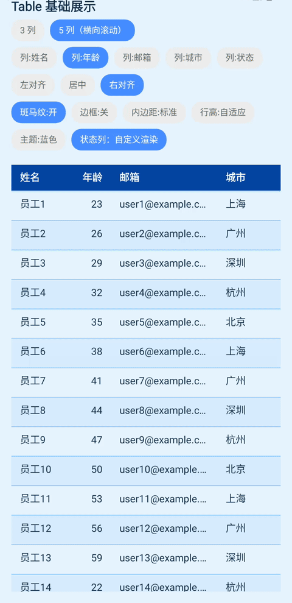
</div>

### 自定义 Renderer 验证

7 列模式用于验证 `cellRenderer` 可承载 KuiklyUI 子组件。表格不内置头像、状态标签或 Switch 业务列，这些内容都由使用方在 renderer 中自行实现。

| 左侧：renderer 示例 + 姓名 + 年龄 + 邮箱 + 状态 | 横滑右侧：状态 + 城市 + renderer 示例 |
| --- | --- |
| 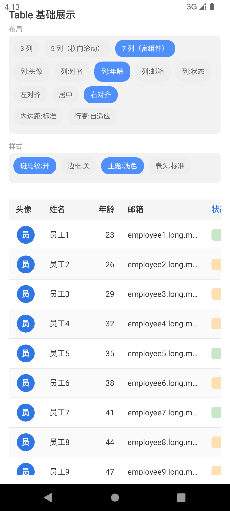 | 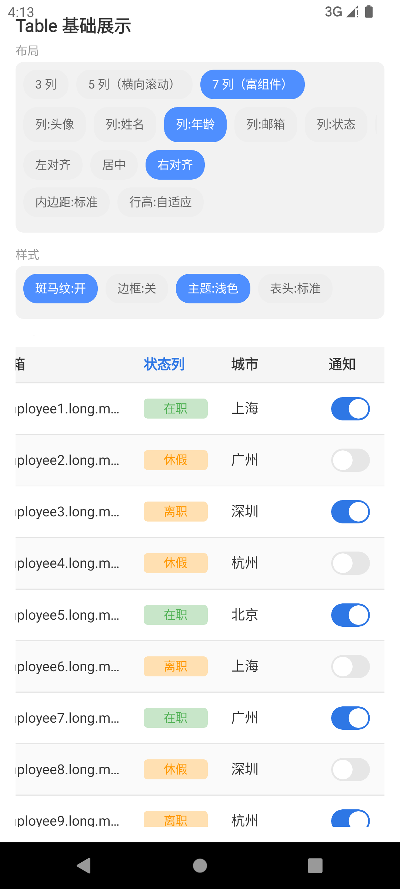 |

### 显式 Mobile List

Mobile List 不再按列数自动触发。Demo 中点击 `模式:List` 可切换为 grouped list 形态；点击 `模式:Table` 可回到横向表格。

| Mobile List | Empty 状态 |
| --- | --- |
| 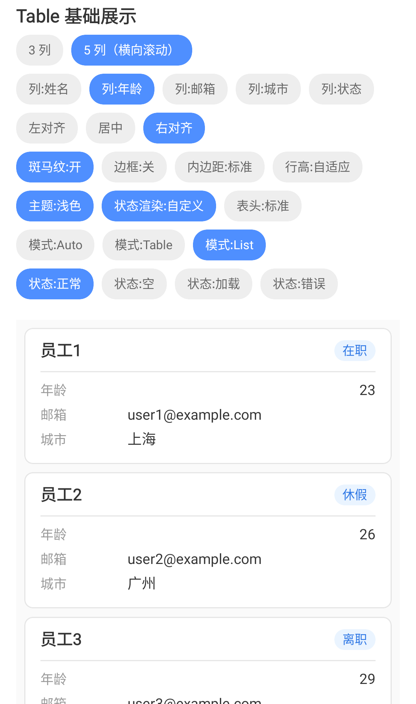 | 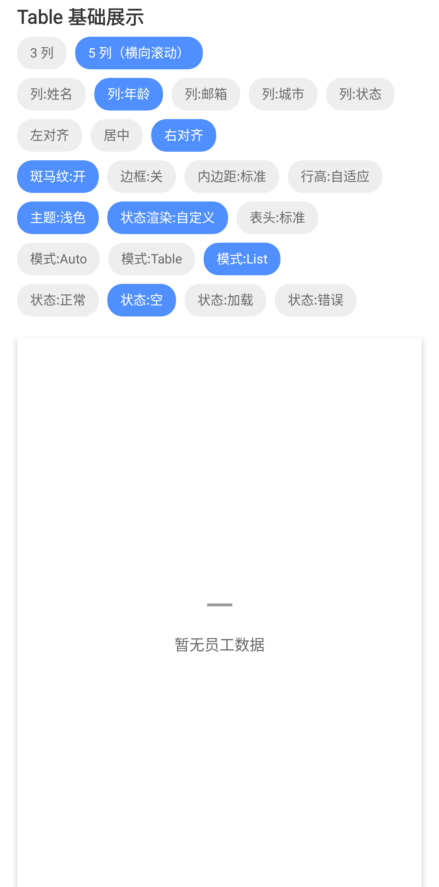 |

| Loading 状态 | Error 状态（重试入口） |
| --- | --- |
| 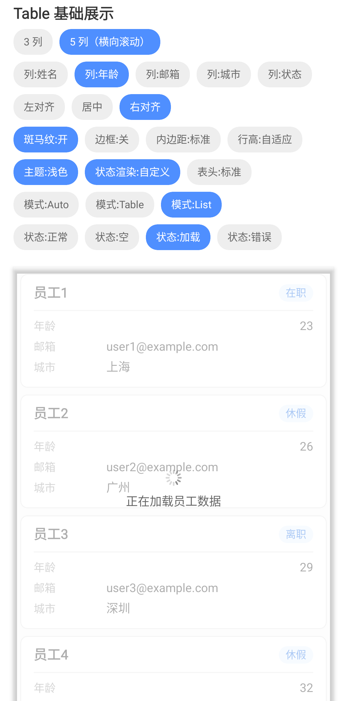 | 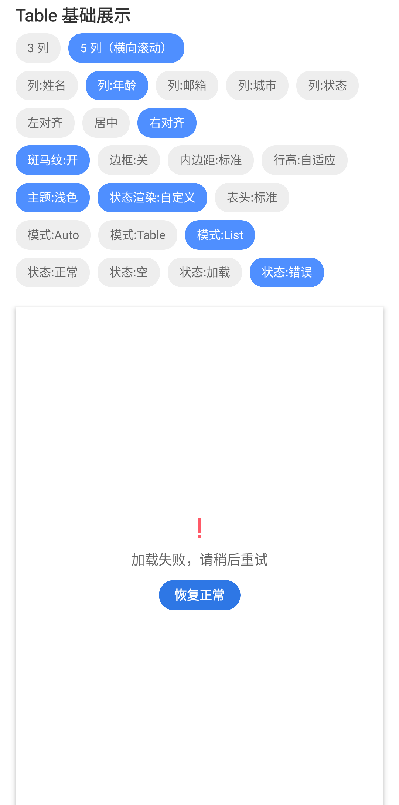 |

<div align="center">
  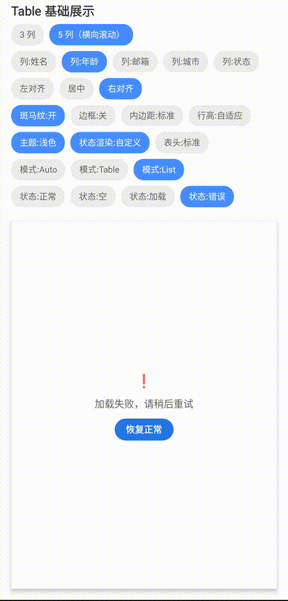
</div>

### 溢出提示

被截断的默认文本单元格支持点击触发溢出事件，Demo 使用该事件展示 title-like 全文提示。

<div align="center">
  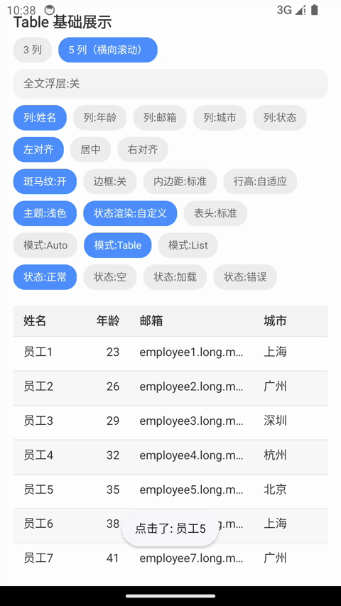
</div>

## Demo 配置面板

`shared` 模块内置演示页 `table_basic`，Android 宿主启动后默认进入该页面。配置面板分为四组：

- **布局**：3 列 / 5 列横向滚动 / 7 列 renderer 验证切换，任意列对齐方式，内边距与行高。
- **样式**：斑马纹、边框、主题、表头紧凑模式。
- **渲染**：状态列自定义 renderer 开关、溢出提示开关。
- **模式与状态**：显式 MobileMode（Table / List）、状态层（正常 / 空 / 加载 / 错误）。

所有看起来可点击的配置项都会改变可观察状态或触发明确业务动作。

## 自定义 Renderer 设计边界

`cellRenderer` 是表格暴露给使用方的单元格内容插槽。Table 负责列宽、行高、边框、滚动、主题和默认文本 fallback；单元格内部的头像、标签、图片、按钮、开关等业务内容由使用方实现。

```kotlin
ColumnModel<User>(
    key = "status",
    title = "状态",
    accessor = { it.status },
    width = 90f,
    cellRenderer = { user, _ ->
        View {
            attr {
                flex(1f)
                allCenter()
            }
            Text {
                attr {
                    text(user.status)
                    fontSize(12f)
                }
            }
        }
    },
)
```

Demo 中的圆形首字头像、状态标签和 Switch 仅用于证明 renderer 容器能承载不同 KuiklyUI 子组件，不代表 Table 内置这些业务组件。

## 快速使用

```kotlin
TableView<User> {
    attr {
        columns.addAll(
            listOf(
                ColumnModel(key = "name", title = "姓名", accessor = { it.name }, width = 80f),
                ColumnModel(
                    key = "age",
                    title = "年龄",
                    accessor = { it.age.toString() },
                    width = 60f,
                    alignment = ColumnAlignment.End,
                ),
                ColumnModel(key = "email", title = "邮箱", accessor = { it.email }),
            )
        )
        data = users
        zebraStripe = true
        bordered = false
        mobileMode = TableMobileMode.Table
        mobilePrimaryColumnKey = "name"
        mobileStatusColumnKey = "status"
    }
    event {
        rowClick = { user -> /* 行点击 */ }
        retry = { /* 重新加载 */ }
    }
}
```

## 核心 API

### TableView

```kotlin
fun <T> ViewContainer<*, *>.TableView(init: TableView<T>.() -> Unit)
```

### TableAttr

| 属性 | 类型 | 默认值 | 说明 |
| --- | --- | --- | --- |
| `columns` | `ObservableList<ColumnModel<T>>` | 空列表 | 列定义列表 |
| `data` | `List<T>` | `emptyList()` | 数据源 |
| `zebraStripe` | `Boolean` | `true` | 是否启用斑马纹 |
| `bordered` | `Boolean` | `false` | 是否显示列分隔线；水平分隔线始终显示 |
| `cellPaddingH` | `Float` | `12f` | 单元格水平内边距 |
| `cellPaddingV` | `Float` | `10f` | 单元格垂直内边距 |
| `rowHeight` | `Float` | `0f` | 固定行高；`0f` 表示由内容自适应 |
| `themeColors` | `TableThemeColors` | `TableThemeColors()` | 表头、文字、分隔线、行背景、状态层、卡片等语义色 |
| `mobileMode` | `TableMobileMode` | `TableMobileMode.Table` | 显式移动端展示模式，不按列数自动切换 |
| `mobilePrimaryColumnKey` | `String?` | `null` | Mobile List 主字段列；未配置时使用第一列 |
| `mobileStatusColumnKey` | `String?` | `null` | Mobile List 状态标签列；未配置时不显示状态标签 |
| `mobileStatusTagPresetByText` | `Map<String, TableStatusTagPreset>` | `emptyMap()` | Mobile List 状态文本到语义预设的业务映射 |
| `mobileStatusTagStyleByText` | `Map<String, TableStatusTagStyle>` | `emptyMap()` | Mobile List 状态文本到具体标签色的业务映射，优先级高于语义预设 |
| `mobileStatusTagStyleResolver` | `((T, String, TableThemeColors) -> TableStatusTagStyle)?` | `null` | Mobile List 状态标签样式解析器；未配置时使用 success / warning / danger / neutral / info 预设 |
| `loading` | `Boolean` | `false` | Loading 状态；保留旧内容并降低透明度 |
| `errorText` | `String?` | `null` | Error 状态文案；非 null 时显示错误层 |
| `emptyText` | `String` | `"暂无数据"` | Empty 状态文案 |
| `loadingText` | `String` | `"加载中…"` | Loading 状态文案 |
| `retryText` | `String` | `"重试"` | Error 状态重试按钮文案 |
| `enableOverflowCellClick` | `Boolean` | `true` | 是否为截断的默认文本单元格启用溢出点击事件 |

### ColumnModel

| 字段 | 类型 | 默认值 | 说明 |
| --- | --- | --- | --- |
| `key` | `String` | - | 列唯一标识 |
| `title` | `String` | - | 表头文字 |
| `accessor` | `(T) -> String` | - | 从数据行提取该列显示值 |
| `width` | `Float?` | `null` | 固定列宽；`null` 表示弹性宽度 |
| `flex` | `Float` | `1f` | 弹性权重，`width` 为 `null` 时生效 |
| `alignment` | `ColumnAlignment` | `Start` | 对齐方式，运行时修改会触发表格重渲染 |
| `cellRenderer` | `ViewContainer<*, *>.(T, ColumnModel<T>) -> Unit` | `null` | 自定义单元格内容；未配置时使用默认 Text |
| `headerRenderer` | `ViewContainer<*, *>.(ColumnModel<T>) -> Unit` | `null` | 自定义表头内容；未配置时使用默认 Text |

### TableMobileMode

| 值 | 说明 |
| --- | --- |
| `Table` | 强制使用横向表格 |
| `List` | 强制使用 Mobile List grouped list |

## Roadmap

- [x] 列定义、行列渲染、列对齐、斑马纹、文字截断
- [x] 横向滚动 + 纵向滚动 + 固定表头
- [x] 边框、内边距、行高配置
- [x] 主题预设与自定义单元格 renderer
- [x] renderer 验证示例（头像、状态标签、Switch 由 Demo 使用方实现）
- [x] 空 / 加载 / 错误状态层
- [x] 显式 Mobile Table / Mobile List 模式
- [x] 截断单元格溢出提示事件
- [ ] 行选择（Checkbox / 单选）
- [ ] 列排序
- [ ] 筛选
- [ ] 分页
- [ ] 固定列
- [ ] 虚拟滚动

## License

[MIT](LICENSE)
