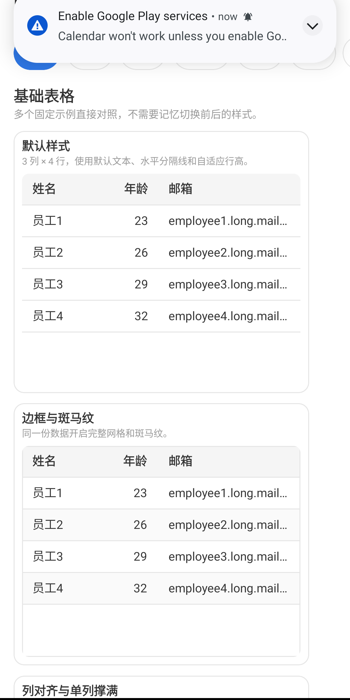
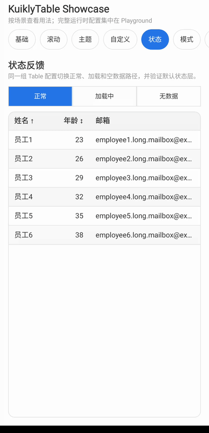

# KuiklyTable

本仓库是 KuiklyUI 犀牛鸟Issue表格组件活动的独立仓库作答。包含表格组件实现、showcase 验证页面、跨端宿主工程和截图/GIF 验收材料。

KuiklyTable 基于 KuiklyUI ComposeView 路线实现，在 `commonMain` 内使用 `View`、`Text`、`Scroller`、`List` 等基础组件组合渲染。当前重点是 Simple Table 展示能力和 Data Table Basic 交互能力的逐步验证。

## 快速运行

1. 使用 Android Studio 打开本仓库。
2. 运行 `androidApp`。
3. App 默认进入 `table_basic` Table showcase 页面。
4. 通过顶部章节导航查看基础、滚动、主题、自定义、状态和模式示例；在 Playground 调整完整运行时配置。

如需调试其他 Kuikly 页面，可通过 `KuiklyRenderActivity.start(context, pageName, pageData)` 显式传入目标页面名。

也可以在命令行验证编译：

```bash
./gradlew :KuiklyTable:compileDebugKotlinAndroid
./gradlew :shared:compileDebugKotlinAndroid
./gradlew :androidApp:compileDebugKotlin
```

## 项目结构

| 模块 | 说明 |
| --- | --- |
| `KuiklyTable` | 表格组件本体，包含列模型、主题、TableView 渲染和事件 API |
| `shared` | showcase / Demo 模块，提供 `table_basic` 验收页面 |
| `androidApp` | Android 宿主，用于运行、截图和 GIF 录制 |
| `iosApp` / `ohosApp` | iOS / 鸿蒙宿主工程 |
| `assets` | README 展示截图和 GIF 验收材料 |

## 当前能力

- 列定义：`ColumnModel` 支持 key、title、accessor、固定 `width`、弹性 `minWidth + flex` 和列对齐。
- 数据模型：外部 `data` 保持调用方拥有且不被修改；Table 内部生成带 `rowKey`、原始位置和展示位置的派生行，Table / List 模式共用同一顺序。
- 基础展示：表头、数据行、斑马纹、默认水平分隔线、可选完整网格边框、行高和内边距配置。
- 滚动：单个横向 `Scroller` 包裹表头和纵向 `List`，保证横向滚动时表头和内容同步；纵向滚动时表头固定。
- 容器：Table Root 接收外部宽高或 flex，内部 Viewport 按组件实际 frame 解析列宽，不使用整个页面宽度替代组件宽度。
- 数据浏览：可排序列支持表头升序、降序、取消三态切换。
- 固定能力：表头可配置固定或随内容滚动；固定列仍在重新验证，不进入当前 Demo。
- 主题：内置 Light / Dark 预设，并支持通过 `TableThemeColors` 覆盖语义色。
- 自定义渲染：支持数据单元格 `cellRenderer` 和表头 `headerRenderer`；Table 只提供渲染插槽，头像、状态标签和 Switch 均为 Demo 使用方示例。
- 状态层：支持默认、加载中、无数据三种表格展示状态；错误和重试由业务页面自行管理。
- 展示模式：由使用方显式选择 `TableDisplayMode.Table` 或 `TableDisplayMode.List`；不按列数自动切换。
- 溢出提示：默认文本单元格被截断时可触发 `overflowCellClick`，由使用方决定展示 tooltip / popover / sheet。

## 活动题目对应

| 题目要求 | 仓库实现 | Demo 入口 |
| --- | --- | --- |
| 多行多列与基础样式 | 列模型、行列渲染、行/列边框、内边距、对齐 | `基础样式` |
| 横纵双向滚动 | 横向 Scroller + 纵向 List，表头固定 | `双向滚动` |
| 简洁 DSL | `TableView<T>` + `ColumnModel<T>` + attr/event 配置 | README 快速使用 |
| 主题定制（加分项） | Light / Dark / Blue 与完整语义色覆盖 | `主题定制` |
| 自定义渲染（加分项） | `cellRenderer` / `headerRenderer` 插槽 | `自定义渲染` |

List 模式、无数据和加载中属于补充示例，不替代题目核心验收。

## 内部架构

对外仍只有一个 `TableView<T>` DSL，内部按数据、布局和独立视觉组件分层：

```text
TableView
├── TableDataPipeline          source data → displayRows
├── TableColumnLayoutResolver  生成列、列宽与 contentWidth
├── TableHeaderRowView         独立表头行组件
├── TableRowView               独立 Table 模式数据行组件
└── TableListRowView           独立 List 模式数据行组件
```

`TableRowView` 和 `TableListRowView` 只接收一行实际需要的数据和配置，并通过事件向上通知；它们不直接持有根 `TableView`。Cell 暂时保留为 Row 内部渲染单元，避免大数据表为每个单元格额外创建 `ComposeView`；出现编辑、焦点或单元格选择状态后再升级为独立组件。

## 效果预览

以下截图来自当前 `table_basic` 分章节 showcase，统一展示同一版页面结构与组件样式。

### 静态预览

| **基础表格** | **双向滚动** |
| :---: | :---: |
|  |  |
| **主题定制** | **自定义 Renderer** |
|  |  |
| **状态反馈** | **Table / List 模式** |
|  |  |

宽表可横向浏览完整列并独立纵向滚动；主题示例直接对照 Light / Dark / Blue 语义色；Renderer 示例同时保留未配置时的默认文本 fallback。状态页支持正常、加载中、无数据三态，模式页由使用方显式选择 Table 或 List，不按列数自动切换。

### 交互演示

| **横纵双向滚动** | **正常 / 加载中 / 无数据** |
| :---: | :---: |
|  |  |

排序示例已在基础章节提供普通列/可排序列对照；未排序、升序、降序三态的独立录屏仍待补充，暂不以静态箭头替代交互证据。

## Showcase 与 Playground

`shared` 模块内置演示页 `table_basic`，Android 宿主启动后默认进入该页面。页面只挂载当前章节，避免所有示例同时创建：

- **基础**：默认样式、边框/斑马纹、单列撑满与对齐单选，以及普通列/可排序列对照和排序三态。
- **滚动**：5 列 × 20 行宽表，验证横纵滚动和固定表头开关。
- **主题**：Light、Dark、Blue 三个小表格直接对照。
- **自定义**：默认文本 fallback 与使用方 renderer 表格直接对照；头像、标签和 Switch 都由 Demo 代码实现。
- **状态**：同一组 Table 配置在正常、加载中和无数据之间切换。
- **模式**：相同数据的 Table 模式与 grouped List 模式对照。
- **Playground**：集中调整列对齐、斑马纹、网格、行高、内边距、renderer 和溢出提示。

所有看起来可点击的配置项都会改变可观察状态或触发明确业务动作。

## 自定义 Renderer 设计边界

`cellRenderer` 是表格暴露给使用方的单元格内容插槽。Table 负责列宽、行高、边框、滚动、主题和默认文本 fallback；单元格内部的头像、标签、图片、按钮、开关等业务内容由使用方实现。

```kotlin
ColumnModel<User>(
    key = "status",
    title = "状态",
    accessor = { it.status },
    width = 90f,
    cellRenderer = { user, _ ->
        View {
            attr {
                flex(1f)
                allCenter()
            }
            Text {
                attr {
                    text(user.status)
                    fontSize(12f)
                }
            }
        }
    },
)
```

Demo 中的圆形首字头像、状态标签和 Switch 仅用于证明 renderer 容器能承载不同 KuiklyUI 子组件，不代表 Table 内置这些业务组件。

## 快速使用

```kotlin
TableView<User> {
    attr {
        columns.addAll(
            listOf(
                ColumnModel(key = "name", title = "姓名", accessor = { it.name }, width = 80f),
                ColumnModel(
                    key = "age",
                    title = "年龄",
                    accessor = { it.age.toString() },
                    width = 60f,
                    alignment = ColumnAlignment.End,
                    sortable = true,
                    sortComparator = compareBy { it.age },
                ),
                ColumnModel(
                    key = "email",
                    title = "邮箱",
                    accessor = { it.email },
                    minWidth = 140f,
                    flex = 2f,
                ),
            )
        )
        data = users
        rowKey = { user -> user.id }
        zebraStripe = true
        bordered = false
        autoIndexColumn = false
        fixedHeader = true
        fixedColumnCount = 0
        rowHeight = 48f
        displayMode = TableDisplayMode.Table
        listPrimaryColumnKey = "name"
        listStatusColumnKey = "status"
    }
    event {
        rowClick = { user -> /* 行点击 */ }
        sortChange = { state -> /* 观察排序状态 */ }
    }
}
```

## 核心 API

### TableView

```kotlin
fun <T> ViewContainer<*, *>.TableView(init: TableView<T>.() -> Unit)
```

程序化滚动控制可通过持有 `TableView` 实例调用：

| 方法 | 说明 |
| --- | --- |
| `scrollToTop(animated: Boolean = false)` | 滚动到当前 Table/List 内容顶部 |
| `scrollToRow(index: Int, animated: Boolean = false)` | 滚动到指定展示行；越界 index 会就近处理，动态行高和 List 模式使用估算高度 |

### TableAttr

| 属性 | 类型 | 默认值 | 说明 |
| --- | --- | --- | --- |
| `columns` | `ObservableList<ColumnModel<T>>` | 空列表 | 列定义列表 |
| `data` | `List<T>` | `emptyList()` | 数据源 |
| `rowKey` | `((T) -> Any)?` | `null` | 当前数据集中唯一、同一业务行在数据更新前后稳定的业务行标识；建议使用 String/Int/Long。未配置时使用源数据索引 fallback。重复 key 不支持，组件不会自动去重、改写或修复。该 key 用于派生行身份和后续行状态关联；经典 `vfor` 暂无 key selector，不宣称控制底层节点复用 |
| `zebraStripe` | `Boolean` | `true` | 是否启用斑马纹 |
| `bordered` | `Boolean` | `false` | 是否显示外框和竖向分隔线；水平分隔线始终显示 |
| `cellPaddingH` | `Float` | `12f` | 单元格水平内边距 |
| `cellPaddingV` | `Float` | `10f` | 单元格垂直内边距 |
| `rowHeight` | `Float` | `0f` | 固定行高；`0f` 表示由内容自适应 |
| `sortState` | `TableSortState` | 未排序 | 当前单列排序状态；点击 sortable 表头后由组件更新 |
| `autoIndexColumn` | `Boolean` | `false` | 内部生成序号列，使用派生行的展示位置编号；当前 Demo 不启用 |
| `indexColumnTitle` | `String` | `"序号"` | 自动序号列表头 |
| `indexColumnWidth` | `Float` | `56f` | 自动序号列宽度 |
| `fixedHeader` | `Boolean` | `true` | 表头是否保持在纵向滚动区域上方 |
| `fixedColumnCount` | `Int` | `0` | 实验性左侧固定列数量；双 List 纵向同步仍待重新设计，当前 Demo 固定为 0 |
| `themeColors` | `TableThemeColors` | `TableThemeColors()` | 表头、文字、分隔线、行背景、状态层、卡片等语义色 |
| `displayMode` | `TableDisplayMode` | `TableDisplayMode.Table` | 显式选择 Table 或 List 模式，不按列数自动切换 |
| `listPrimaryColumnKey` | `String?` | `null` | List 模式主字段列；未配置时使用第一列 |
| `listStatusColumnKey` | `String?` | `null` | List 模式状态标签列；未配置时不显示状态标签 |
| `listStatusTagPresetByText` | `Map<String, TableStatusTagPreset>` | `emptyMap()` | List 模式状态文本到语义预设的业务映射 |
| `listStatusTagStyleByText` | `Map<String, TableStatusTagStyle>` | `emptyMap()` | List 模式状态文本到具体标签色的业务映射，优先级高于语义预设 |
| `listStatusTagStyleResolver` | `((T, String, TableThemeColors) -> TableStatusTagStyle)?` | `null` | List 模式状态标签样式解析器；未配置时使用 success / warning / danger / neutral / info 预设 |
| `loading` | `Boolean` | `false` | Loading 状态；保留旧内容并降低透明度 |
| `emptyText` | `String` | `"暂无数据"` | Empty 状态文案 |
| `loadingText` | `String` | `"加载中…"` | Loading 状态文案 |
| `emptyRenderer` | `ViewContainer<*, *>.() -> Unit` | `null` | 自定义 Empty 状态内容；未配置时保留默认空态图形和 `emptyText` |
| `loadingRenderer` | `ViewContainer<*, *>.() -> Unit` | `null` | 自定义 Loading 状态内容；未配置时保留默认加载指示和 `loadingText` |
| `enableOverflowCellClick` | `Boolean` | `true` | 是否为截断的默认文本单元格启用溢出点击事件 |

### ColumnModel

| 字段 | 类型 | 默认值 | 说明 |
| --- | --- | --- | --- |
| `key` | `String` | - | 列唯一标识 |
| `title` | `String` | - | 表头文字 |
| `accessor` | `(T) -> String` | - | 从数据行提取该列显示值 |
| `width` | `Float?` | `null` | 固定列宽；`null` 表示弹性宽度 |
| `minWidth` | `Float` | `100f` | 最小列宽；仅在 `width` 为 `null` 时生效，剩余空间从该宽度起分配 |
| `flex` | `Float` | `1f` | 剩余空间分配权重；仅在 `width` 为 `null` 时生效 |
| `alignment` | `ColumnAlignment` | `Start` | 对齐方式，运行时修改会触发表格重渲染 |
| `sortable` | `Boolean` | `false` | 是否允许点击表头切换排序 |
| `sortComparator` | `Comparator<T>?` | `null` | 业务值比较器；未配置时按 accessor 字符串比较 |
| `cellRenderer` | `ViewContainer<*, *>.(T, ColumnModel<T>) -> Unit` | `null` | 自定义单元格内容；未配置时使用默认 Text |
| `headerRenderer` | `ViewContainer<*, *>.(ColumnModel<T>) -> Unit` | `null` | 自定义表头内容；未配置时使用默认 Text |

### TableDisplayMode

| 值 | 说明 |
| --- | --- |
| `Table` | 强制使用横向表格 |
| `List` | 使用 grouped list 展示 |

## Roadmap

当前 KuiklyTable Basic：

- [x] 列定义、行列渲染、列对齐、斑马纹、文字截断
- [x] 横向滚动 + 纵向滚动 + 固定表头
- [x] 边框、内边距、行高配置
- [x] 主题预设与自定义单元格 renderer
- [x] renderer 验证示例（头像、状态标签、Switch 由 Demo 使用方实现）
- [x] 默认 / 加载中 / 无数据状态层
- [x] 显式 Table / List 模式
- [x] 截断单元格溢出提示事件
- [x] 单列排序
- [ ] 自动序号列（暂不纳入当前 Demo）
- [x] 可配置固定表头
- [ ] 左侧固定列（双 List 纵向同步待重新设计）
- [ ] 大数据可见窗口渲染（旧实验已移除，后续重新设计）
- [ ] 自定义 Empty / Loading renderer
- [ ] 轻量加载更多回调
- [ ] 对外滚动控制 API
- [x] 布局与数据管线单元测试
- [x] `rowKey` API 约束文档化
- [ ] 尺寸预设（可选）

行选择、过滤、分页、编辑等数据交互后续归入独立的 `KuiklyDataTable`；树形数据归入 `KuiklyTreeTable`。这些能力不计入当前 Basic 完成度。

## License

[MIT](LICENSE)
