# KuiklyTable

[](LICENSE)
[](https://kotlinlang.org)
[](https://github.com/Tencent-TDS/KuiklyUI)
[](https://arialentropy.github.io/KuiklyTableView/site/)

基于 [KuiklyUI](https://github.com/Tencent-TDS/KuiklyUI) 的跨端表格组件，支持 Android、iOS、鸿蒙。

仓库提供两级正式表格：`KuiklyTable`（L1 Basic）与 `KuiklyDataTable`（L2）。

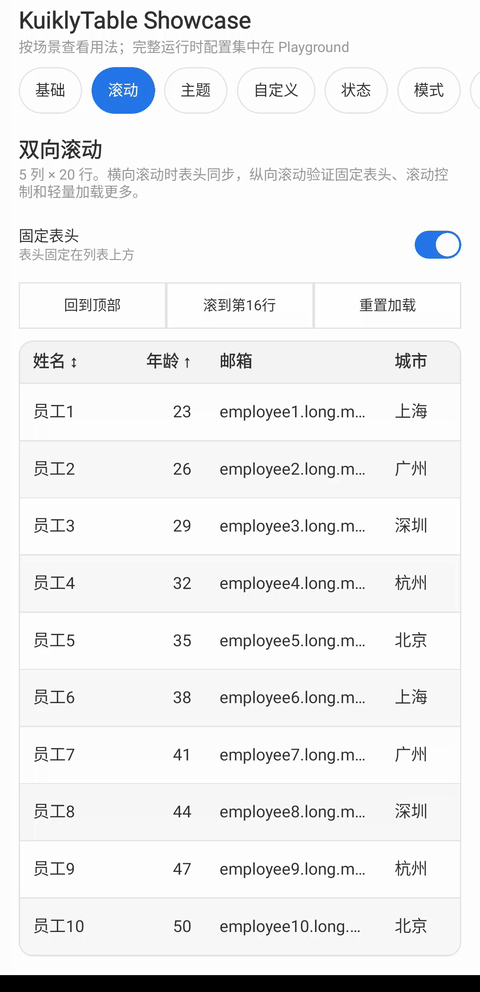

## 组件族

| 入口 | 定位 | Showcase | 状态 |
| --- | --- | --- | --- |
| `TableView` / KuiklyTable | 基础展示、布局、分隔线、滚动、固定表头/左固定列、主题、renderer | `table_basic`（分章节验证） | L1 已交付 |
| `DataTableView` / KuiklyDataTable | 行选择、全选/半选、与排序 rowKey 联动；筛选与客户端分页 | `table_data`（数据交互 / 基础组合 / 接入关系） | L2 已交付：行选择、筛选、客户端分页 |

## 效果预览

### KuiklyTable

静态对照：

| 基础样式 | 主题三套 | 自定义 Renderer |
| :---: | :---: | :---: |
| 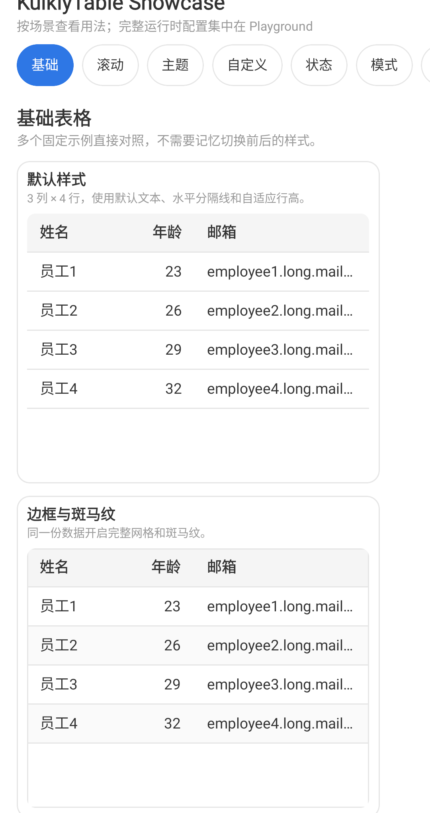 | 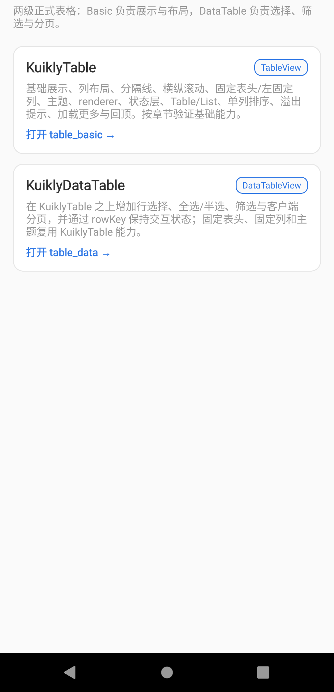 | 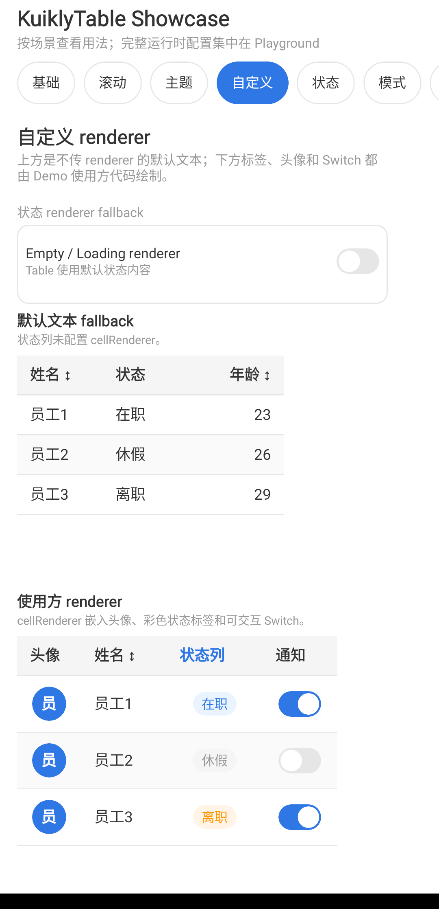 |

| 状态反馈 | Table / List 模式 |
| :---: | :---: |
| 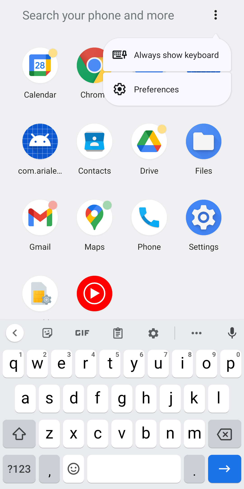 | 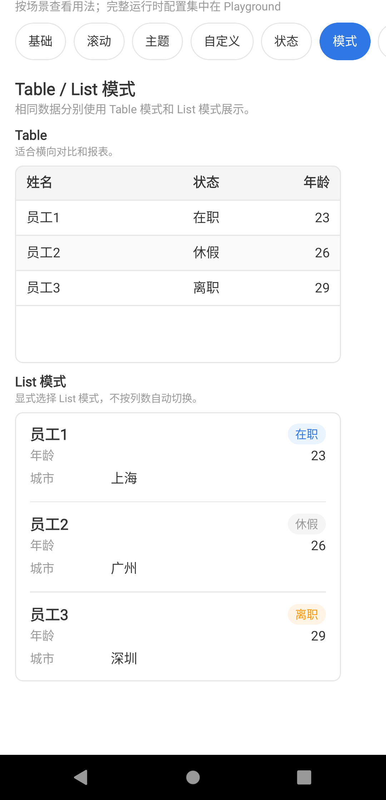 |

交互录屏：

| 双向滚动 | 排序三态 | 大数据虚拟滚动 |
| :---: | :---: | :---: |
|  | 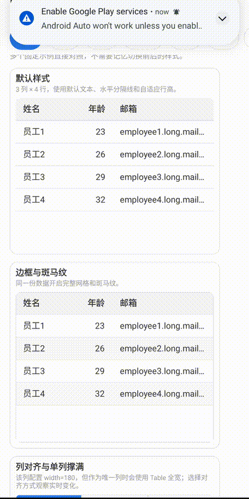 | 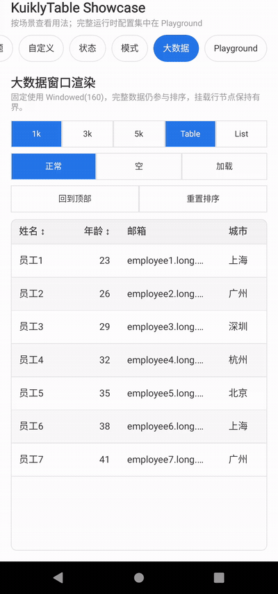 |

### KuiklyDataTable

Showcase 页 `table_data`：顶部配置区分「数据交互 / 基础组合 / 接入关系」页签，表格占剩余高度。

| 行选择 | 表头全选 |
| :---: | :---: |
| 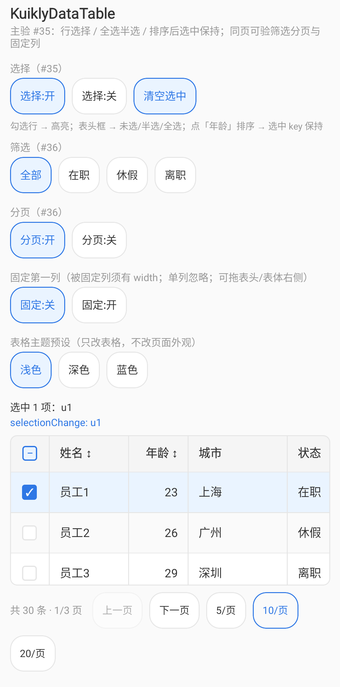 | 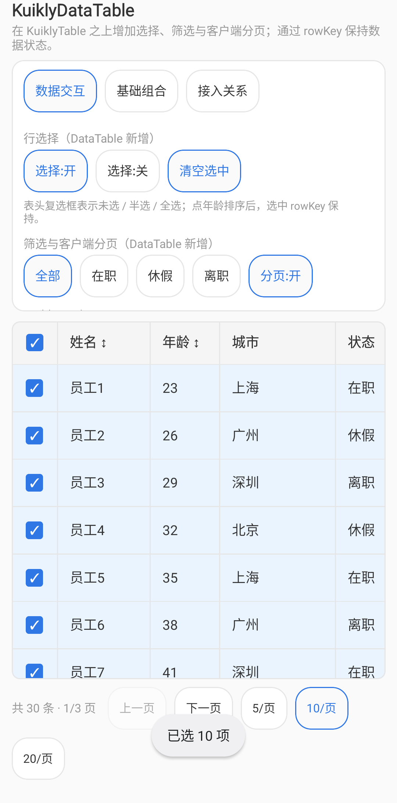 |

| 状态筛选 | 客户端分页 |
| :---: | :---: |
| 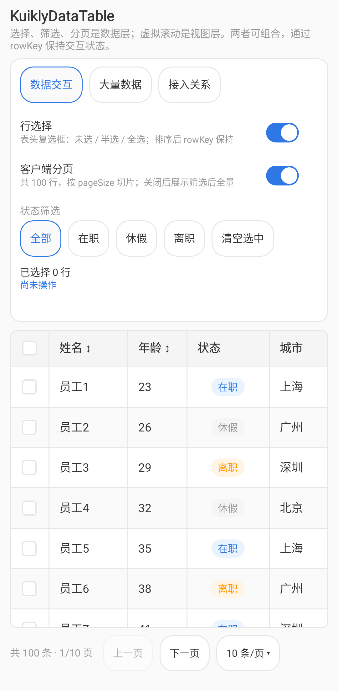 | 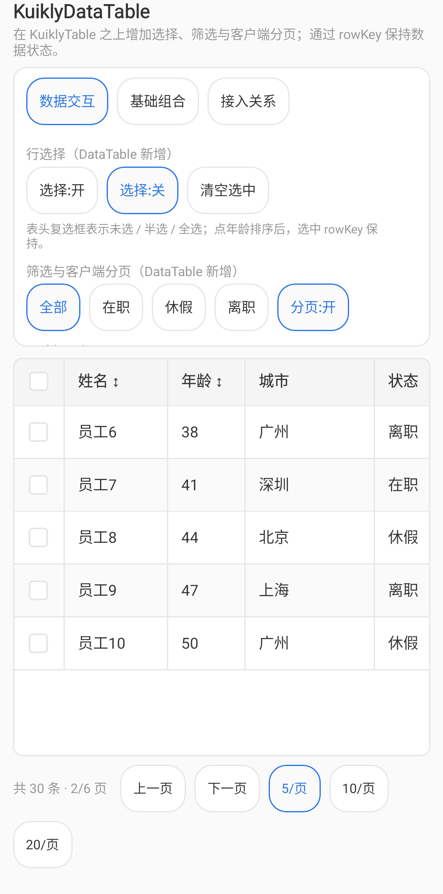 |

## 功能特性

| 类别 | 能力 |
| --- | --- |
| 基础结构 | `TableView` / `ColumnModel`，固定列宽与弹性 `minWidth + flex` |
| 滚动 | 横纵双向滚动，表头与内容横向同步；可选固定表头；左侧固定列（单 List，需固定行高） |
| 样式 | 默认网格线与 8dp 圆角；`lineMode` 可切无线/仅横线/网格/自定义；斑马纹、行高、内边距可配；列对齐默认 `Start`（左对齐），未显式设置时数值列也不居右 |
| 主题 | Light / Dark 预设，`TableThemeColors` 语义色覆盖（含选中行背景） |
| 自定义渲染 | `cellRenderer` / `headerRenderer`；未配置回退默认文本 |
| 交互 | 表头三态排序、行点击、单元格点击、截断溢出点击、回顶；列上 `enableRowClick` / `enableCellClick` 显式控制 |
| 状态 | 加载中 / 空数据，支持自定义 Empty / Loading 内容 |
| 展示模式 | 显式 `Table` 或 `List`（grouped） |
| 数据加载 | `loadMore` 触底回调（分页与请求由业务层负责） |
| 大数据 | 显式 `Standard` / `Windowed` 行渲染策略；窗口模式限制已挂载 DSL 行节点 |
| 高级表格 | `DataTableView` 行多选、表头全选/半选、`filterPredicate` 筛选、客户端分页与翻页回顶；选中按 rowKey 联动 |

## 接入方式

将本仓库的 `KuiklyTable` 模块引入你的 Kuikly 工程：

```kotlin
// settings.gradle.kts
include(":KuiklyTable")
project(":KuiklyTable").projectDir = file("path/to/KuiklyTable")
```

```kotlin
// 业务模块 build.gradle.kts
kotlin {
    sourceSets {
        val commonMain by getting {
            dependencies {
                implementation(project(":KuiklyTable"))
            }
        }
    }
}
```

## 基础用法

```kotlin
data class User(
    val id: String,
    val name: String,
    val age: Int,
    val email: String,
)

TableView<User> {
    attr {
        columns.addAll(
            listOf(
                ColumnModel(key = "name", title = "姓名", accessor = { it.name }, width = 80f),
                ColumnModel(
                    key = "age",
                    title = "年龄",
                    accessor = { it.age.toString() },
                    width = 60f,
                    sortable = true,
                    sortComparator = compareBy { it.age },
                ),
                ColumnModel(
                    key = "email",
                    title = "邮箱",
                    accessor = { it.email },
                    minWidth = 140f,
                    flex = 2f,
                ),
            )
        )
        data = users
        rowKey = { it.id }
        zebraStripe = true
        fixedHeader = true
    }
    event {
        rowClick = { user -> /* 行点击 */ }
        cellClick = { info -> /* 单元格点击 */ }
        sortChange = { state -> /* 排序变化 */ }
    }
}
```

`DataTableView` 复用同一套列与数据源，叠加行选择、筛选与客户端分页：

```kotlin
DataTableView<User> {
    attr {
        flex(1f) // 撑满父容器，否则 Table 拿不到高度不会渲染
        enableRowSelection = true
        selectedKeys = currentSelectedKeys
        filterPredicate = { it.status == "在职" } // null 表示不过滤
        enablePagination = true
        pageIndex = currentPage
        pageSize = 10
        // columns / data / rowKey 写法同 TableView
    }
    event {
        selectionChange = { keys -> currentSelectedKeys = keys }
        pageChange = { index -> currentPage = index }
        pageSizeChange = { size -> pageSize = size }
    }
}
```

## 文档

完整用法指南与 API 参考（左代码、右效果图对照）：

**https://arialentropy.github.io/KuiklyTableView/site/**

涵盖：列宽与对齐、排序、滚动与固定表头、主题、自定义渲染、分隔线与圆角、左侧固定列、状态与加载更多、展示模式、大数据窗口渲染、行选择、筛选与分页，以及 `TableAttr` / `TableEvent` / `ColumnModel` / `DataTableAttr` / `DataTableEvent` 完整 API 表格。

文档源码在 `site/index.html`（单文件，GitHub Pages 托管）。

## 核心 API 摘要

常用属性（完整表见文档站）：

| 属性 | 说明 |
| --- | --- |
| `columns` / `data` / `rowKey` | 列定义 / 数据源 / 稳定行标识 |
| `themeColors` | 语义色；预设 `Light` / `Dark` / `Blue`，可 `copy` 覆盖 |
| `lineMode` / `cornerRadius` | 分隔线（默认 `Grid`）/ 圆角（默认 8dp） |
| `fixedHeader` / `fixedFirstColumn` | 固定表头（默认开）/ 左侧固定列 |
| `displayMode` | `Table` / `List` |
| `rowRenderMode` | `Standard` / `Windowed(n)` 大数据窗口渲染 |
| `loading` / `emptyText` / `hasMore` / `loadingMore` | 状态与加载更多 |
| `enableRowSelection` / `selectedKeys` | DataTable 行选择与受控选中 |
| `filterPredicate` | DataTable 筛选谓词 |
| `enablePagination` / `pageIndex` / `pageSize` | DataTable 客户端分页 |

常用事件：

| 事件 | 说明 |
| --- | --- |
| `rowClick` / `cellClick` / `sortChange` | 行 / 单元格点击、排序变化 |
| `overflowCellClick` / `loadMore` | 截断文本点击、触底加载更多 |
| `selectionChange` / `pageChange` / `pageSizeChange` | DataTable 选择与分页回调 |

## 示例工程

1. Android Studio 打开本仓库
2. 运行 `androidApp`
3. 默认进入 `table_home`；再进入：
   - `table_basic`：按章节（基础 / 滚动 / 主题 / 自定义 / 状态 / 模式 / 大数据）对照验证
   - `table_data`：配置区分「数据交互 / 基础组合 / 接入关系」页签，表格占剩余高度

也可 `adb` 指定 `pageName=table_basic` 或 `pageName=table_data`。

```bash
./gradlew :androidApp:compileDebugKotlin
```

## 测试

```bash
./gradlew :KuiklyTable:allTests
```

`commonTest` 覆盖：

- `TableDataPipelineTest` — 排序管线
- `TableColumnLayoutResolverTest` — 列宽分配
- `TableLineModeTest` — None/Horizontal/Grid/Custom 解析
- `TableRowRenderModeTest` — Standard / Windowed 配置
- `TableLoadMoreTriggerPolicyTest` — 加载更多触发去重
- `DataTableSelectionTest` — 全选半选与 rowKey 选择联动
- `DataTablePipelineTest` — 筛选 → 排序 → 分页管线

## 相关资源

- [Kuikly 官方文档](https://kuikly.tds.qq.com/)
- [KuiklyUI](https://github.com/Tencent-TDS/KuiklyUI)
- [Kuikly-contrib](https://github.com/Kuikly-contrib)

## License

[MIT](LICENSE)
